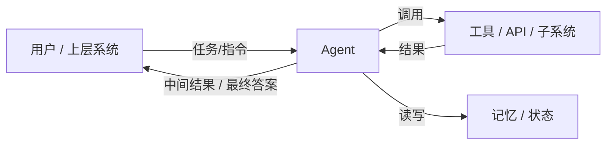
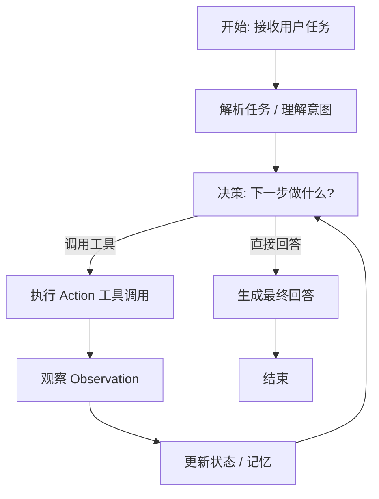
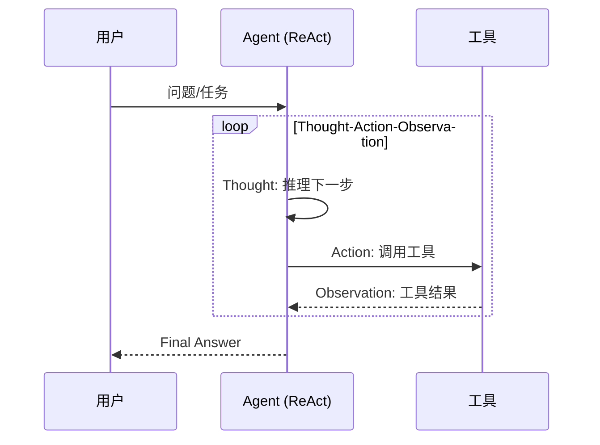
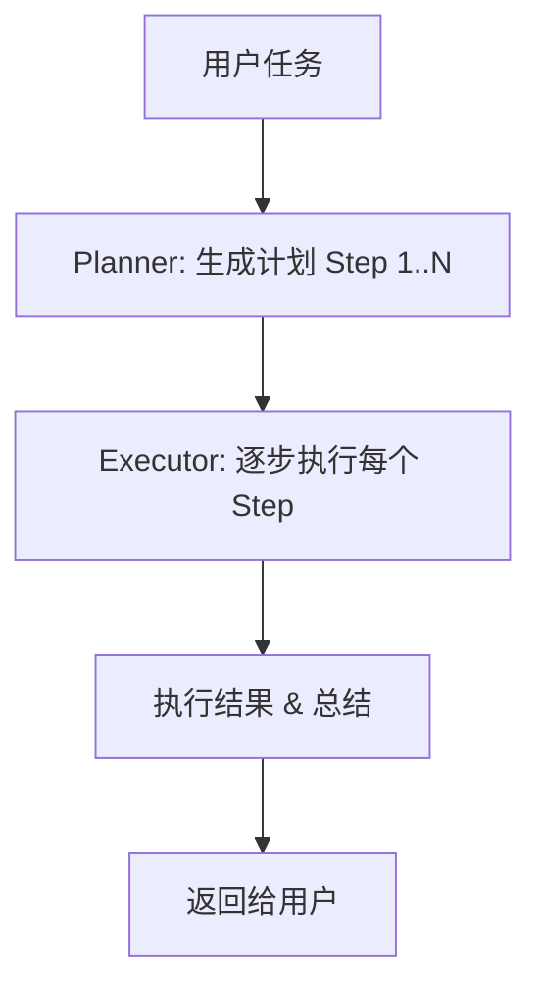
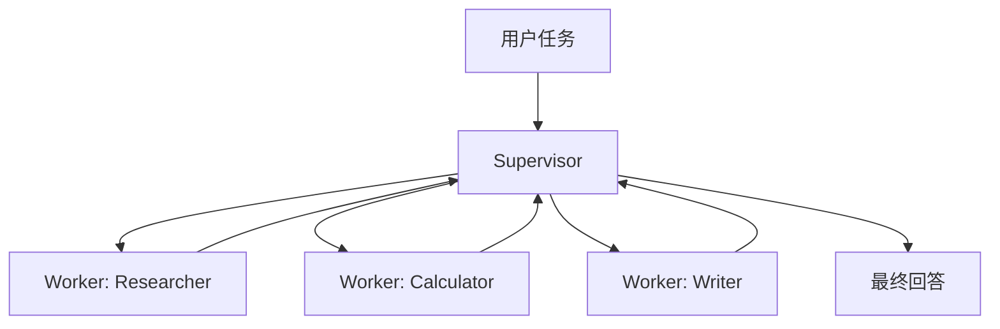
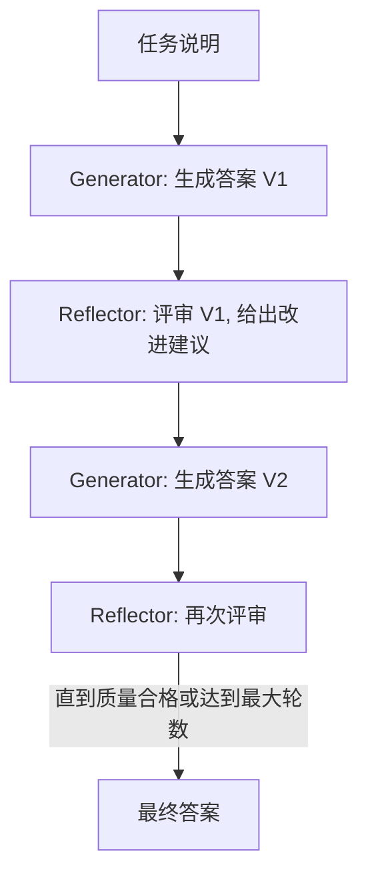

## Agent 原理

### 引言：从 ChatGPT 到 Agent

近几年，大模型（如 ChatGPT）已经很好用了：能聊天、能写代码、能总结资料。  
但如果你仔细观察，会发现它仍然更像一个「超强的函数」而不是一个真正的「智能体」：

- 你给它一个**提示（prompt）**，它给你**一次性输出**；
- 它**不会主动拆解长任务**，也不会自己决定「先查资料再算账、最后再写总结」；
- 它**不会持久记住你的目标**，也不会自行规划步骤或调用外部系统。

**Agent（智能体）**，就是在大模型的基础上，加上**目标、记忆、工具调用、环境交互和长期规划能力**，让它从一个「问答机器」进化为一个能在复杂环境中**自主完成任务的执行者**。

`agent-all-in-one` 项目，就是一个用来演示各种 Agent 范式的**教学/实验仓库**：  
- ReAct 范式  
- Plan-and-Execute 范式  
- Supervisor Multi-Agent 范式  
- Reflection 范式  

下面这篇文章，会围绕这几个问题展开：

1. **Agent 是什么？**
2. **为什么需要 Agent？**
3. **Agent 的通用架构和运行循环是什么样？**
4. **Agent 都有哪些典型范式？`agent-all-in-one` 中各自对应什么实现？**
5. **Agent 相关有哪些经典论文/代表性工作值得一看？**

---

## 一、什么是 Agent？

先给一个**工程视角**的定义：

> **Agent 是一个能够围绕给定目标，持续感知环境、做出决策、调用工具并更新自身状态的智能程序。**

拆开看，一个典型的 LLM Agent 至少包含几个关键要素：

- **目标（Goal）**  
  - 例如：「帮我规划 7 天日本旅行」「写一篇技术博客」「做一轮代码 Review」。
  - 目标可以是一次性的，也可以被长期持有、拆解为子目标。

- **感知（Perception / Observation）**  
  - Agent 需要感知外部世界：搜索结果、数据库查询、API 响应、用户的追加指令等。
  - 在 `agent-all-in-one` 里，这就是**工具返回值（Observation）**。

- **记忆（Memory）**  
  - 短期：本轮对话历史、当前任务上下文。
  - 长期：过往项目、用户偏好、历史工具调用结果等（更高级的系统才有）。

- **推理与决策（Reasoning & Decision Making）**  
  - 决定「下一步该干什么」：是继续问用户、调用搜索工具、还是直接给出答案？
  - ReAct、Plan-and-Execute、Reflection 等范式，本质上都是在设计**不同的决策流程**。

- **行动（Action / Tool Use）**  
  - 调用工具：搜索引擎、计算器、数据库、HTTP API、本地代码执行环境等。
  - 在 `agent-all-in-one` 中，对应 `search`、`calculator`、`get_current_time` 等工具。

- **环境（Environment）**  
  - 包括互联网、文件系统、业务系统、游戏世界（如 Minecraft）、机器人控制系统等。
  - Agent 通过工具与环境交互，从环境中获得新的 Observation。

用一个简单的框图来表示：



在 `agent-all-in-one` 里，**Agent 本身往往被实现为一个「图（Graph）」**，其中每个节点代表一个步骤（如 Planner、Executor、Supervisor、Worker、Reflector 等），这些节点一起实现了上图中的「感知 → 决策 → 行动 → 更新状态」循环。

---

## 二、为什么需要 Agent？

如果我们只用「普通 ChatGPT 模式」，会遇到几个典型问题：

- **无法可靠完成复杂多步骤任务**  
  - 示例：「帮我调研 3 篇最新的 LangGraph 相关技术文章，提取要点，做一个对比表格」  
  - 这背后其实需要：搜索 → 逐篇阅读 → 提取关键信息 → 汇总成结构化结果 → 写总结。  
  - 单轮大模型回答，很容易「跳步骤」「幻觉」或遗漏细节。

- **缺乏与真实世界系统的连接**  
  - 例如：「帮我查当前汇率，并按今天价格估个机票预算」  
  - 大模型本身看不到实时数据，一定要通过「工具」连接真实世界。

- **缺少可观测、可调试的执行流程**  
  - 单次回答你很难知道：  
    - 它有没有去查资料？  
    - 它是怎么做中间推理的？  
  - Agent + 流程图（如 LangGraph）让整个过程变得**可视化、可调试**。

- **无法持续执行长任务**  
  - 比如「帮我持续监控某股票的新闻，重要消息发通知」。  
  - 这类任务需要长期运行的 Loop，而不仅仅是一次性输出。

因此，Agent 的价值可以概括为：

- **从「大模型 = 强函数」升级到「大模型 = 可编排的智能子系统」**；
- 让大模型**能主动拆解任务、选择工具、调用环境，并在过程中自我修正**；
- 让开发者可以像搭积木一样，将 ReAct / Plan-and-Execute / Multi-Agent / Reflection 等模式组合起来。

---

## 三、通用 Agent 架构与运行循环

无论是哪种范式（ReAct / Plan-and-Execute / 等），背后都有一个类似的「总循环」：

> 接收任务 → 解析任务 → 规划/决策下一步 → 行动（调用工具/子 Agent）→ 观察结果 → 更新状态与计划 → 判断是否结束。

可以用一个伪代码式的循环来描述：

```text
while not done:
  1. 读取当前目标 + 状态 + 观察结果
  2. 大模型做推理（思考）：下一步该干什么？
  3. 得到决策：
     - 直接给出最终回答？ -> done = True
     - 调用某个工具？ -> 调用工具，获取新 Observation
     - 拆分为子任务？ -> 生成子计划 or 分配给其他 Agent
  4. 更新内部状态 / 记忆
```

简单的流程图示意：



在 `agent-all-in-one` 中，这个循环被用**不同方式具体化**：

- `react_agent/agent.py`：在**思考（Thought）— 行动（Action）— 观察（Observation）**的循环中实现；
- `plan_execute_agent/`：把「规划」「执行」拆到不同节点（Planner / Executor）；
- `multi_agent/graph.py`：通过 Supervisor 调度不同 Worker，在图结构中走不同路径；
- `reflection_agent/`：在 Generator ↔ Reflector 之间形成一个「改写—评价—再改写」的闭环。

---

## 四、Agent 常见范式总览

围绕 LLM 构造 Agent，目前比较常见的几类范式是：

- **ReAct 范式**：  
  - Thought（思考） + Action（行动） + Observation（观察）循环。  
  - 适合**工具有限、任务较短**的场景。

- **Plan-and-Execute 范式**：  
  - 先由 Planner 生成一个**完整计划/任务分解**，再由 Executor 逐步执行。  
  - 适合**复杂、多步骤、可清晰拆解**的任务。

- **Supervisor Multi-Agent 范式**：  
  - 有一个负责「任务分配」的 Supervisor，底下挂多个专长不同的 Worker。  
  - 适合**需要多技能并行协作**的场景，如「搜索 + 计算 + 写作」。

- **Reflection 范式**：  
  - Agent 会「审视自己之前的输出」，根据评审反馈做迭代改写。  
  - 适合**对输出质量要求极高**的任务，如技术文章、复杂分析报告。

`agent-all-in-one` 恰好分别实现了这四种范式，对应目录为：

- `react_agent/`
- `plan_execute_agent/`
- `multi_agent/`
- `reflection_agent/`

---

## 五、`agent-all-in-one` 中的四种典型 Agent 范式

### 5.1 ReAct 范式：推理 + 行动

**核心思想：**  
把大模型的**自然语言推理能力（Reasoning）**和**工具调用能力（Acting）**交替结合起来，在「思考—行动—观察」的循环中逐步解决问题。

一个典型的 ReAct 交互日志大概是这样的（简化版）：

```text
Question: 计算 123 * 456 等于多少？

Thought: 这是一个乘法计算，我应该调用计算器工具。
Action: calculator("123 * 456")
Observation: 56088

Thought: 已经得到结果，可以回答用户了。
Final Answer: 123 * 456 = 56088。
```

ReAct 的通用流程图：



在 `agent-all-in-one` 中：

- **实现位置**：`react_agent/agent.py`  
- **工具定义**：`react_agent/tools.py`  
- **特点**：
  - 实现简单、灵活；
  - 把**中间推理过程暴露为可观察的「Thought」文本**，很好调试；
  - 更适合「一次性问题」或「工具数量不太多」的场景。

---

### 5.2 Plan-and-Execute 范式：先规划，再执行

当任务很复杂时，直接用 ReAct 可能会「想到哪做到哪」，缺乏全局视角。  
Plan-and-Execute 范式把整个过程拆为两层：

1. **Planner（规划器）**：一次性生成一个**较完整的任务计划**；
2. **Executor（执行器）**：顺着计划一步步执行，每一步内部可以再用 ReAct/工具等。

示意流程：



一个典型例子：

```text
用户任务：帮我规划一次去日本的 7 天旅行，包括：
  - 机票预估预算
  - 每天的城市安排
  - 必去景点和大致价格区间

Planner 可能生成类似的计划：
  Step 1: 通过搜索获取从用户城市飞往东京/大阪的往返机票平均价格
  Step 2: 估算 7 天的住宿预算，按中档酒店标准
  Step 3: 设计 Day 1-7 的城市和景点安排
  Step 4: 输出包含预算和行程表的总结文档

Executor 按 Step 1 -> 2 -> 3 -> 4 顺序执行，每一步都可以用工具/子 Agent。
```

在 `agent-all-in-one` 中：

- **规划相关代码**：`plan_execute_agent/planner.py`  
- **执行相关代码**：`plan_execute_agent/executor.py`  
- **Agent 入口**：`plan_execute_agent/agent.py`  
- **适用场景**：
  - 长任务、结构比较清晰的任务（旅行规划、项目 Roadmap 设计、调研报告等）；
  - 需要**先看整体再细化**的情况；
  - 便于在 LangGraph Studio 中可视化：你能看到 Planner 节点出一个计划，Executor 节点按计划一步步跑。

---

### 5.3 Supervisor Multi-Agent 范式：多智能体协作

有些任务「内含多种技能」，比如：

> 「搜索今天的天气，计算 256 * 789，然后写一份总结。」

如果全部交给一个 Agent 来做，它当然也能完成，但会变得「又要查资料，又要算，又要写」，逻辑混杂。  
多智能体范式把不同职责拆开，让**多个专长不同的 Agent 协同工作**，由一个上层 Supervisor 负责调度。

在 `agent-all-in-one` 中，多智能体结构大致是：

- **Supervisor（主管）**：  
  - 在 `multi_agent/supervisor.py`  
  - 负责理解全局任务，决定「什么时候让哪个 Worker 出场」。

- **Workers（工作者）**：在 `multi_agent/workers.py` 中定义，例如：
  - `Researcher`：使用搜索工具获取信息；
  - `Calculator`：负责准确计算（数学/逻辑计算）；
  - `Writer`：负责用自然语言输出总结/报告。

可以画成这样的结构：



一个典型的执行流程可能是：

```text
1. 用户给出复合任务（搜索 + 计算 + 写作）
2. Supervisor 分析任务，先调用 Researcher 搜集事实
3. Researcher 用 search 工具查资料，返回 Observation
4. Supervisor 根据 Observation 调用 Calculator 完成数值计算
5. 最后 Supervisor 把数据交给 Writer 生成自然语言总结
6. 返回综合结果给用户
```

这种范式的优点：

- **职责清晰**：每个 Worker 专精一类任务，更易于调试和扩展；
- **容易并行化**：多个 Worker 可以并行执行子任务；
- **贴合现实团队协作**：Supervisor 就像项目经理，Workers 像不同专业的工程师。

---

### 5.4 Reflection 范式：反思与自我改进

当你希望 Agent 产出**高质量内容**（比如技术文章、方案设计、代码优化建议），一次性输出往往不够。  
Reflection 范式的核心，是让 Agent 拥有「自我审阅、反思并改写」的能力。

在 `agent-all-in-one` 中，典型角色和流程：

- **Generator（生成器）**：`reflection_agent/generator.py`
  - 根据任务和历史反馈，生成当前版本的答案。

- **Reflector（反思器）**：`reflection_agent/reflector.py`
  - 给当前答案做 Review：指出问题、不足、改进方向。
  - 反馈可以从多个维度考虑：准确性、完整性、清晰度、结构等。

- **迭代闭环**：



一个简单例子（写技术文章）：

```text
Round 1:
  Generator 输出一篇「LangGraph 简介」文章
  Reflector 评审：指出缺少使用示例、对比传统流程编排方式、没有提到可视化调试

Round 2:
  Generator 根据反馈扩展：加入代码示例、小项目 demo、图示
  Reflector 再次评审：结构有点松散，可以重构为「概念 -> 使用 -> 示例 -> 总结」

Round 3:
  Generator 重构结构，增加小结和实践建议
  Reflector 认为已达到质量要求 -> 输出最终稿
```

优点：

- **易于反复打磨输出质量**，尤其适合：技术博客、API 文档、系统设计说明；
- 天然适配「人类在回路中」的场景：Reflector 也可以是人，而不是模型；
- 在 LangGraph Studio 中，你能看到每一轮 Generator / Reflector 的中间版本，非常利于调试。

---

## 六、Agent 相关经典论文 / 代表性工作

下面按主题列出一些与 Agent、工具增强 LLM、多智能体协作相关的**经典或代表性工作**，你可以根据兴趣和需要选择阅读。

### 6.1 工具增强与推理（Tool-augmented Reasoning）

- **[ReAct: Synergizing Reasoning and Acting in Language Models](https://arxiv.org/abs/2210.03629)**  
  *Yao et al., 2022*  
  - 提出了 ReAct 范式：将「自然语言推理（Thought）」与「行动（Action）」交替结合，用于工具调用和环境交互。  
  - 对应 `agent-all-in-one` 中的 `react_agent/` 实现。

- **[Toolformer: Language Models Can Teach Themselves to Use Tools](https://arxiv.org/abs/2302.04761)**  
  *Schick et al., 2023*  
  - 研究如何让大模型通过自监督方式，在预训练阶段就「学会插入合适的工具调用」，而不是只在推理阶段硬编码；  
  - 更偏向「模型训练策略」，但对实际 Agent 设计有启发：**工具调用可以是训练出来的模式，而不是完全手工 Prompt**。

- **[PAL: Program-Aided Language Models](https://arxiv.org/abs/2211.10435)**  
  *Chen et al., 2022*  
  - 提出让模型**生成可执行代码片段（如 Python）**来完成复杂推理任务，再执行代码获得结果；  
  - 在 Agent 语境下，可以看作是「把工具 = 代码执行环境」，通过代码而不是纯文本进行严谨推理。

- **[Chain-of-Thought Prompting Elicits Reasoning in Large Language Models](https://arxiv.org/abs/2201.11903)**  
  *Wei et al., 2022*  
  - 不直接讲 Agent，但给出了让模型显式写出中间推理步骤（思维链）的技巧；  
  - ReAct 可以看作是在 CoT 基础上，再接了一层「工具行动」。

### 6.2 反思与自我改进（Reflection / Self-Refine）

- **[Reflexion: Language Agents with Verbal Reinforcement Learning](https://arxiv.org/abs/2303.11366)**  
  *Shinn et al., 2023*  
  - 倡导让 Agent 对自己的行为结果做「语言化反思」，并利用反思来改进后续策略；  
  - 与 `agent-all-in-one` 中的 **Reflection 范式**高度契合：Generator + Reflector 的闭环。

- **[Self-Refine: Iterative Refinement with Self-Feedback](https://arxiv.org/abs/2303.17651)**  
  *Madaan et al., 2023*  
  - 让模型对自己的回答生成反馈（例如指出模糊、不准确之处），再根据反馈改写答案；  
  - 对写作、代码生成、翻译等任务非常实用，是很多 Reflection 型 Agent 的灵感来源。

### 6.3 规划、搜索与决策（Planning / Search）

- **[Tree of Thoughts: Deliberate Problem Solving with Large Language Models](https://arxiv.org/abs/2305.10601)**  
  *Yao et al., 2023*  
  - 把大模型的推理过程看作在「思维树」上进行搜索，而不是一条线性的思维链；  
  - 为更复杂的规划型 Agent 提供了搜索框架：可以保留多条候选思路，做回溯和评估。

- **[Plan-and-Solve Prompting](https://arxiv.org/abs/2305.04091)**（可查阅相关工作）  
  - 思想与 Plan-and-Execute 很接近：**先让模型显式写出计划，再按计划解决任务**；  
  - 在 `agent-all-in-one` 中，`plan_execute_agent/` 其实就是这种思想的工程化实现。

### 6.4 多智能体与长期任务（Multi-Agent / Long-horizon Agents）

- **[Voyager: An Open-Ended Embodied Agent with Large Language Models](https://arxiv.org/abs/2305.16291)**  
  *Wang et al., 2023*  
  - 在 Minecraft 环境中构建了一个「会自己探索、记忆、学习技能」的长期 Agent；  
  - 关键点在于：**技能库（技能程序的记忆）、长期目标、与环境的持续交互**。  
  - 对于理解「真正意义上的 Agent（不仅是 QA 机器人）」非常有启发。

- **Auto-GPT / BabyAGI 等开源项目（虽然不都是论文）**  
  - 把 LLM 装上「目标管理、任务分解、任务队列、执行器、记忆」等模块，形成较完整的 Agent 系统；  
  - 是许多工程实践中「多轮自动执行、反复调用工具」范式的早期样板。

---

## 七、如何选择和实践这些 Agent 范式？

结合 `agent-all-in-one`，可以给出一个简单的「**学习和实践路径**」：

1. **从 ReAct 入门**  
   - 先理解 Thought / Action / Observation 循环；  
   - 在 `react_agent/` 中观察：  
     - 模型是如何决定「该用哪个工具」的？  
     - 工具输入/输出是如何以文本形式被包装起来的？

2. **向 Plan-and-Execute 过渡**  
   - 在 `plan_execute_agent/` 里理解 Planner / Executor 拆分后的好处：  
     - Planner 只考虑「做什么」和「顺序」；  
     - Executor 只负责「一步步把事情做完」。  
   - 在 LangGraph Studio 中查看这两类节点的执行路径。

3. **尝试 Multi-Agent 协作**  
   - 打开 `multi_agent/graph.py` 和 `workers.py`，看看：  
     - Supervisor 是根据什么信息决定调用哪个 Worker？  
     - Worker 之间有没有共享状态 / 记忆？  
   - 尝试给系统增加一个新 Worker（比如「翻译专家」），体会可扩展性。

4. **最后玩转 Reflection 范式**  
   - 在 `reflection_agent/` 中观察 Generator 和 Reflector 的反复交互；  
   - 尝试调高/调低「迭代轮数」，看看输出质量和时间的权衡；  
   - 把你正在写的技术文章交给这个 Agent 打磨试试。

---

## 小结

- **Agent 是什么**：在大模型之上，加入目标、记忆、工具和环境交互的「智能执行体」。  
- **为什么需要 Agent**：为了解决复杂任务、多工具协同、长时运行以及可观测调试的问题。  
- **常见范式**：ReAct、Plan-and-Execute、Supervisor Multi-Agent、Reflection 等，各有适用场景。  
- **`agent-all-in-one` 的价值**：它把这些范式都做了一个**最小但完整的工程实现**，配合 LangGraph Studio，可以清楚看到 Agent 的内部思考和工具调用链路，非常适合作为你在笔记库《Agent 原理》中的「理论 + 实战」桥梁。