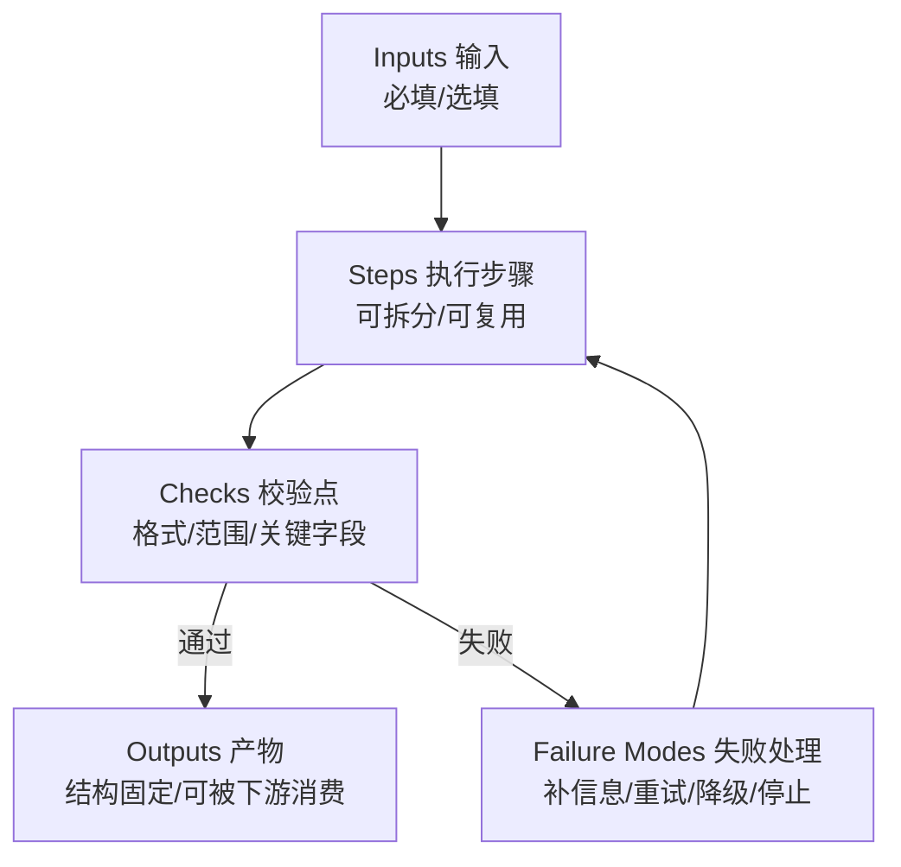
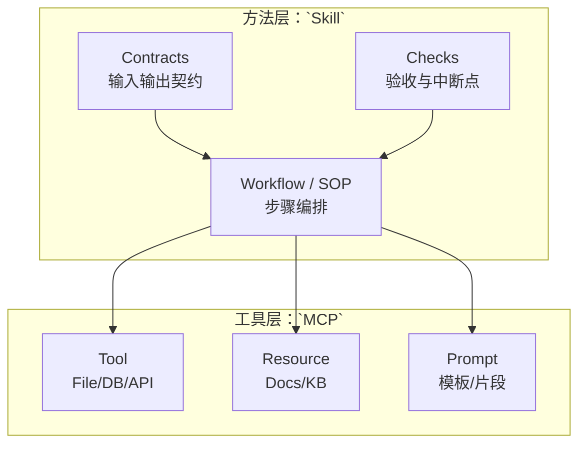

# `Skill`：让 Agent 变得可复用、可控、可演进

## 前言：为什么要把“提示词经验”升级成 `Skill`

如果你只是偶尔问问 ChatGPT，一个“写得不错的 `Prompt`”已经足够。

但只要你开始用 `Agent` 做事（写代码、跑脚本、查资料、写文档、对接系统），很快会撞上三个工程层面的老问题：

- **不稳定**：同一个任务，今天能做对，明天换点上下文就跑偏。
- **不可控**：你知道它“可能会做”，但你说不清它“应该怎么做”，更别提调试。
- **难复用**：每次都要靠“临场发挥”去改提示词，经验沉淀不下来。

我倾向于把这类问题归因到一句话：**你把一段“工作方法”塞进了对话上下文，但它并不是一个“可调用的能力单元”。**

而 `Skill` 的目标很朴素：把“会做”变成“可调用”，把“经验”变成“资产”。

> 相关链接：
> - `Agent` 的工程视角定义：[`AI/Agent 原理.md`](Agent%20原理.md)

## 一、`Skill` 是什么

### 1.1 一句话定义：`Skill` 解决了什么问题

**`Skill` 是对某类任务的“稳定做法”的封装**：它把你希望 `Agent` 遵循的步骤、校验点、输入输出规范、以及可用工具边界，做成一个可以复用的能力单元。

你可以把它理解成：

- 在软件工程里，它更像一个“模块 / 函数”，而不是“临时写在控制台里的命令”；
- 在团队协作里，它更像一份“可执行的 `SOP`”，而不是“某个人脑子里的诀窍”。

### 1.2 `Skill` 的组成：说明、契约、边界、失败处理

一个最小可用的 `Skill`，建议至少回答四个问题：

- **它能做什么**：适用场景与目标（以及 `Non-Goals`：明确“不做什么”）。
- **怎么用它**：输入是什么、输出长什么样（可被下游消费）。
- **它怎么做**：步骤、关键决策点、每步的校验标准。
- **它在什么边界里做**：能调用哪些工具，能读写哪些资源，遇到失败怎么处理（重试/降级/请求用户补充信息）。

这里面最“反直觉”的，是 **输入输出契约**。

很多人写提示词只关注“你要做什么”，但忽略“你要输出什么结构”。结果就是：看起来像在执行，但产物不可用、不可组合、不可验证。

### 1.3 一张图看懂：`Skill` 的“可验收执行链”

如果只看文字，`Skill` 很容易被误解成“更长的 `Prompt`”。其实它更像一条**可中断、可回退、可验收**的执行链：



### 1.4 `Skill` 的颗粒度：什么时候拆，什么时候合

我的经验是：把 `Skill` 的颗粒度控制在“**一次对话里可以讲清楚、一次执行里可以验收**”。

一个粗糙但好用的判断方式：

- **该拆的信号**：
  - 一个 `Skill` 里出现了多种完全不同的决策路径；
  - 产物形态差异很大（时而写报告、时而写代码、时而查数据）；
  - 你发现自己想给它加越来越多的“如果……就……否则……”。
- **该合的信号**：
  - 拆开后每个 `Skill` 都依赖前一个 `Skill` 的半成品；
  - 你需要用户频繁“手动串联”多个 `Skill` 才能完成一个最小任务。

---

## 二、为什么需要 `Skill`

### 2.1 复用：把个人经验变成团队资产

在没有 `Skill` 的世界里，经验往往以三种形式存在：

- 某个“写得不错”的聊天记录；
- 某个人脑子里的“手感”；
- 一个越写越长、越改越乱的系统提示词。

`Skill` 的价值在于：**它让经验具备可复制性**。

| 维度 | 普通 Prompt | Skill (能力单元) |
| :--- | :--- | :--- |
| **主要载体** | 一段聊天记录 / 临时指令 | 独立文件 (.md / .mdc) |
| **复用性** | 依赖复制粘贴 | 可被路由、可被导入 |
| **关注点** | "帮我把这个做了" | "按这个标准流程做" |
| **稳定性** | 随机性强，依赖模型心情 | 有校验点，输出结构固定 |
| **维护方式** | 每次重写 | 版本管理 (Git) |

一旦你把能力写成 `Skill`，它就可以：

- 被别的 `Agent` 复用；
- 被同一个 `Agent` 在不同项目复用；
- 被团队评审、迭代、版本化。

### 2.2 可控：让结果稳定，过程可解释

“可控”不是指让模型不犯错，而是指：

- 你能明确它“应该按哪些步骤做”；
- 你能定位它“在哪一步偏了”；
- 你能以最小代价修复（改 `Skill` 的某个步骤/校验点），而不是重写整段提示词。

这其实就是把 `Agent` 从“玄学”拉回“工程”的核心手段。

### 2.3 降低上下文膨胀：按需注入，而不是永久塞进系统提示词

当你把所有经验都塞进系统提示词时，你会得到一个“看起来无所不能”的 `Agent`，但代价是：

- 上下文越来越大，模型注意力被稀释；
- 规则之间开始互相打架；
- 修改任何一处都可能引入连锁反应。

`Skill` 的思路是：**默认轻装上阵，需要某项能力时再加载该能力的说明与约束**。

### 2.4 团队协作视角：写 `Skill` 像写 `SOP`，用 `Skill` 像调用函数

当你把 `Skill` 当成团队资产后，很多工程问题会自然出现一套“正确做法”：

- 需要 review（否则每个人都会写出一套不兼容的输出格式）；
- 需要版本号（否则你不知道线上用的是哪一版）；
- 需要验收标准（否则你只是在写“更长的文字”）。

---

## 三、`Skill` 和 `MCP` 的区别

一句话概括：

- **`Skill` 解决“怎么做”**：方法、流程、校验、产物。
- **`MCP` 解决“能做什么”**：把外部工具/资源用标准协议接进来，让 `Agent` 可调用。

你可以把它理解成两层：

- **工具层（`MCP`）**：提供可调用的 `Tool` / 可读取的 `Resource` / 可复用的 `Prompt`。
- **方法层（`Skill`）**：把工具按某种可靠流程组织起来，形成稳定产物。

```mermaid
graph TD
    User[用户 User] -->|自然语言指令| Agent
    
    subgraph Agent Runtime
        SystemPrompt[System Prompt<br/>(人设、基础约束)]
        Router[决策/路由层]
    end
    
    Agent --> SystemPrompt
    SystemPrompt --> Router
    
    subgraph Skill Layer [Skill 层 (怎么做)]
        S_Write[写作 Skill<br/>(SOP、校验、格式)]
        S_Code[代码 Skill<br/>(重构、测试、Review)]
        S_Search[搜索 Skill<br/>(关键词优化、总结)]
    end
    
    Router -->|匹配场景| S_Write
    Router -->|匹配场景| S_Code
    
    subgraph MCP Layer [MCP 工具层 (能做什么)]
        T_File[文件读写 Tool]
        T_DB[数据库 Tool]
        T_Web[联网搜索 Tool]
    end
    
    S_Write -->|调用| T_File
    S_Code -->|调用| T_File
    S_Search -->|调用| T_Web
```

> 相关链接：
> - 如果你想完整理解 `MCP`：[`AI/MCP 原理及 Java 开发指南.md`](MCP%20原理及%20Java%20开发指南.md)

### 3.1 典型误区：把 `Skill` 当 `Tool`，或把 `MCP` 当工作流引擎

常见的两个走偏方式：

- **把 `Skill` 当 `Tool`**：把 `Skill` 写成“调用某个接口的说明书”，最后得到的是一个脆弱的、只在某个项目里能跑通的流程。
- **把 `MCP` 当工作流引擎**：以为“把工具接进来”就等于“事情能做好”，但缺少 `Skill` 的校验点与产物标准，最后输出仍然不可控。

真正的组合方式通常是：**`Skill` 调用 `MCP Tool`**。

### 3.2 一个直观类比：`Skill` 是“代码结构”，`MCP` 是“依赖注入”

如果把 `Agent` 当作一个软件系统：

- `MCP` 更像依赖注入：我把数据库、文件系统、内网 API 这些能力“接进来”；
- `Skill` 更像业务代码：我规定“什么时候查库”“什么时候读文件”“什么时候让用户确认”，并把产物结构固定下来。

再用一张图表达“谁依赖谁”会更直观：



---

## 四、如何设计一个“好用”的 `Skill`

这一节更偏方法论：你不需要任何框架，也不需要先写代码，只要把它当成“写给未来自己的 `SOP`”。

### 4.1 先写 `Non-Goals`：不做什么，比做什么更重要

一个 `Skill` 最容易失控的地方是“贪多”。

建议在开头直接写清楚：

- 这个 `Skill` **不处理**哪些情况；
- 这些情况应该交给哪个 `Skill` / 交给用户补充什么信息；
- 失败时允许的降级方案是什么。

这会显著减少 `Agent` 的“自作主张”。

### 4.2 再写校验点：每一步都可验证、可中断、可回退

好 `Skill` 的关键不是“步骤多”，而是“每步可验收”：

- **可验证**：每一步输出都能用简单规则检查（格式、范围、关键字段齐全）。
- **可中断**：发现不满足前置条件时，立即停下来问用户，而不是硬编。
- **可回退**：如果某一步失败，有明确的替代路径（例如改用另一种数据源，或先输出 `TODO` 列表）。

这类“校验点”越明确，`Agent` 越像工程系统，而不是聊天机器人。

把 4.1～4.2 合起来，其实就是一个“从目标到验收”的设计流：


### 4.3 最后写触发条件：什么时候该用这个 `Skill`

一个 `Skill` 如果没有“触发条件”，最终会变成“每次都想用，但每次都要解释一遍”。

建议写成三段：

- **适用场景**：满足哪些条件时，优先使用它。
- **不适用场景**：哪些情况不要用。
- **快速自检**：用户只要回答 2～3 个问题，你就能判断该不该启用。

### 4.4 一个可复用的 `Skill` 模板（推荐）

你可以把下面这个模板当成写 `Skill` 的骨架（放在 `SKILL.md` 里也好，放在内部文档里也好）：

```text
Skill 名称：

目标（Goal）：

不做什么（Non-Goals）：

输入（Inputs）：
- 必填：
- 选填：

输出（Outputs）：
- 产物格式：
- 验收标准：

工具边界（Tooling Boundaries）：
- 允许调用：
- 禁止调用：
- 权限与安全要求：

执行步骤（Steps）：
1)
2)
3)

校验点（Checks）：
- Step 1 校验：
- Step 2 校验：

失败处理（Failure Modes）：
- 缺信息：
- 工具失败：
- 结果不可信：
```

### 4.5 实战案例：Java 代码审查 Skill

这是一个真实的 Skill 定义示例，你可以直接存为 `.cursor/rules/java-review.mdc`：

```markdown
---
description: 当用户要求 Review Java 代码时触发
globs: *.java
---

# Java Code Review Skill

## 目标
找出代码中的 NPE 风险、并发问题及不符合阿里巴巴规范的命名。

## Non-Goals
- 不负责重写整个架构
- 不关注缩进和空格（交给 Formatter）

## 审查步骤 (Steps)
1. **安全性检查**：扫描所有入参，检查是否有 `@Nullable` 或未判空的使用。
2. **性能检查**：检查循环中是否有数据库调用或 RPC。
3. **规范检查**：对比变量命名是否符合驼峰，常量是否大写。

## 校验点 (Checkpoints)
- [ ] 每一个指出的问题必须引用具体行号。
- [ ] 每一个修改建议必须提供 `Before` 和 `After` 代码对比。

## 失败处理
- 如果代码依赖缺失导致无法判断类型，请输出 "⚠️ 缺少上下文，假设为..."
```

---

## 五、在 `Claude Code` 和 `Cursor` 上落地 `Skill`

这一节我会尽量给你“可操作”的路径，但不同产品对 `Skill` 的实现细节会随版本变化：**文件放哪里、如何 reload，以你当前环境为准**。

### 5.1 `Claude Code`：把 `Skill` 当成“可发现的能力包”

概念上，你可以把 `Claude Code` 的 `Skill` 当成一个目录（一个能力包）：

- 目录名：`skill` 的名字（也是它被发现/调用时的标识）
- `SKILL.md`：这项能力的说明与执行规范（建议按上面的模板写）
- 其他文件：脚本、示例输入输出、测试用例（可选）

一个推荐的组织方式是把它们放进项目内的 `skills/` 目录，形如：

```text
your-repo/
  skills/
    blog-writer/
      SKILL.md
      examples/
        input.md
        output.md
```

当你需要启用某个 `Skill` 时，核心不是“神秘指令”，而是两件事：

- **让 `Agent` 知道这个 `Skill` 存在**（可发现）
- **让 `Agent` 按 `SKILL.md` 的契约输出**（可验收）

如果你用的是 `Claude Code` 自带的 `Skill` 管理/重载能力（有的版本会提供类似 `/reload` 的命令），建议把它当成“开发态便利功能”，而不是系统设计的前提：真正重要的是目录结构与契约文本本身。

### 5.2 `Cursor`：用 `.cursor/rules/*.mdc` 组织“类 `Skill`”

`Cursor` 当前更偏“`Rules` 驱动”：你把一套稳定做法写进 `.cursor/rules/*.mdc`，它就能在对话/改代码时持续遵循这套约束。

你仓库里已经有一个规则文件：`.cursor/rules/yano-blog-writer.mdc`，它本质上就是一个非常标准的“写作类 `Skill`”：

- **明确流程**：先大纲，再正文（强制交互确认）
- **明确风格**：中文与 English 空格、术语用反引号
- **明确自检清单**：输出前过一遍

如果你要在 `Cursor` 里继续扩展 `Skill`，我建议的做法是：

- **一个 `Skill` 一个 `.mdc` 文件**：命名体现用途（例如 `agent-skill-design.mdc`）
- **默认 `alwaysApply: false`**：避免所有对话都被“规则污染”
- **需要长期生效时再开启**：把 `alwaysApply` 改为 `true`，或把关键规则复制到当前任务上下文里

### 5.3 与 `MCP` 的配合：用 `.cursor/mcp.json` 把工具接入作为能力底座

如果你的 `Skill` 需要“调用外部能力”（读文件、查数据库、访问内网 API），那就让 `MCP` 来解决“接入工具”。示例：

```json
{
  "mcpServers": {
    "local-dev": {
      "command": "java",
      "args": ["-jar", "mcp-server.jar"],
      "env": {
        "WORKSPACE_ROOT": "${workspaceFolder}"
      }
    }
  }
}
```

我更推荐的组合方式是：

- `Skill`（规则/流程）写在 `.cursor/rules/*.mdc` 或 `skills/*/SKILL.md`
- 能力（工具/资源）通过 `.cursor/mcp.json` 接入
- **让 `Skill` 去“调用工具并验收产物”**，而不是让工具去“替你决定做法”

### 5.4 `Skill` 的测试与调试

`Skill` 既然是工程化的，就必须可测试。建议的测试策略：

- **黄金数据集**：保留一组 Input 和 期望的 Output。
- **回归测试**：当你修改 Skill 的步骤时，用上面的 Input 跑一遍，看 Output 格式是否崩坏。
- **调试技巧**：在 Skill 中显式要求 Agent 输出 `<thinking>` 标签，打印它执行每一步时的决策过程。

---

## 六、结尾：`Skill` 的本质，是把“工作方法”产品化

我对 `Skill` 的最短总结是：

> **把“工作方法”写成可复用的能力单元，让 `Agent` 从“会聊”走向“会做”，从“能做”走向“稳定地做”。**

如果你已经在写 `Prompt`、写 `Rules`、接 `MCP` 工具，那你其实已经走在 `Skill` 的路上了：接下来只差把它们“模块化、契约化、可验收化”。

> 相关链接：
> - `Agent` 基础：[`AI/Agent 原理.md`](Agent%20原理.md)
> - `MCP` 基础：[`AI/MCP 原理及 Java 开发指南.md`](MCP%20原理及%20Java%20开发指南.md)

# 我的公众号

我的博客地址：[博客主页](https://yano-nankai.notion.site/yano-nankai/Yano-Space-ff42bde7acd1467eb3ae63dc0d4a9f8c)。

coding 笔记、读书笔记、点滴记录，以后的文章也会同步到公众号（Coding Insight）中，大家关注 `^_^`

<div style="margin: 30px 0;"></div>

