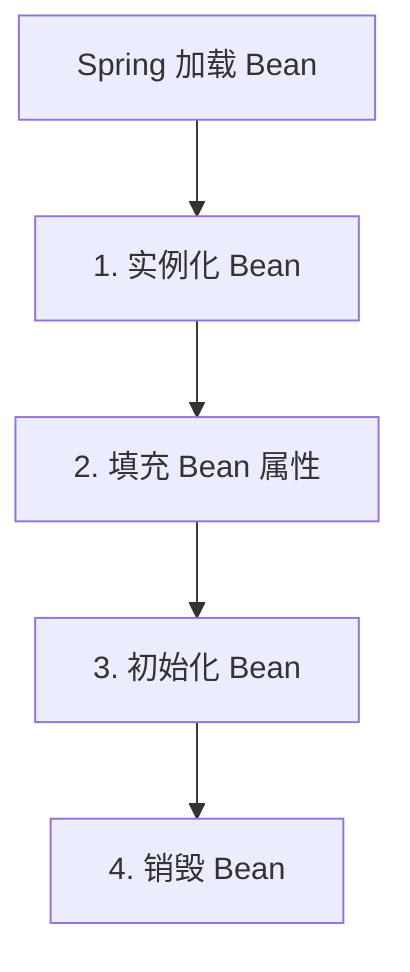

# 版本说明

> 💡 本文使用的版本为：
> - JDK: 17
>- Spring Boot: 3.1.7

# 生命周期

整体流程：



几点说明：
1. ` 实例化 Bean`：此时 Bean 只实例化，并没有进行 @Autowired 属性填充。
2. ` 填充 Bean 属性 `：如果 Bean 的属性有 @Autowired 注解，会进行属性填充。
3. ` 初始化 Bean`
4. ` 销毁 Bean`：如果 Bean 实现了 DisposableBean 接口，会调用 destroy 方法。

分析一下 org.springframework.beans.factory.support.AbstractAutowireCapableBeanFactory#doCreateBean 方法，主体代码如下：

```java
protected Object doCreateBean(final String beanName, final RootBeanDefinition mbd, final @Nullable Object[] args)
        throws BeanCreationException {
    if (mbd.isSingleton()) {
        instanceWrapper = this.factoryBeanInstanceCache.remove(beanName);
    }
    // 1：默认调用无参构造实例化 Bean
    // 如果是只有带参数的构造方法，构造方法里的参数依赖注入，就是发生在这一步
    if (instanceWrapper == null) {
        instanceWrapper = createBeanInstance(beanName, mbd, args);
    }

    // Eagerly cache singletons to be able to resolve circular references
    // even when triggered by lifecycle interfaces like BeanFactoryAware.
    boolean earlySingletonExposure = (mbd.isSingleton() && this.allowCircularReferences &&
            isSingletonCurrentlyInCreation(beanName));
    if (earlySingletonExposure) {
        addSingletonFactory(beanName, () -> getEarlyBeanReference(beanName, mbd, bean));
    }

    // Initialize the bean instance.
    Object exposedObject = bean;
    try {
        // 2：填充属性（DI 依赖注入发生在此步骤）
        populateBean(beanName, mbd, instanceWrapper);
        // 3：调用初始化方法，完成 bean 的初始化操作（AOP 的第三个入口）
        exposedObject = initializeBean(beanName, exposedObject, mbd);
    }
    catch (Throwable ex) {
        // ...
    }
    // ...
```

首先通过一个测试用例，了解 Spring Bean 的生命周期。下面定义了一个 LifeBean：

```java
@Component
@Data
@Slf4j
public class LifeBean implements BeanNameAware, BeanClassLoaderAware, InitializingBean, DisposableBean {
    private int i;

    @PostConstruct
    public void init() {
        log.info("LifeBean init ...");
    }

    @Override
    public void setBeanName(String s) {
        log.info("LifeBean setBeanName {}", s);
    }

    @Override
    public void setBeanClassLoader(ClassLoader classLoader) {
        log.info("LifeBean setBeanClassLoader {}", classLoader);
    }

    @Override
    public void afterPropertiesSet() {
        log.info("LifeBean afterPropertiesSet i = {}", i);
    }

    @Override
    public void destroy() {
        log.info("LifeBean destroy ...");
    }
}
```

单元测试代码：

```java
@Test
public void testLife() {
    LifeBean bean = context.getBean(LifeBean.class);
    bean.setI(1);
}
```

IDE 增加 debug 断点，并加上 Condition：

```java
"lifeBean".equalsIgnoreCase(beanName)
```


log 输出：

```
LifeBean setBeanName lifeBean
LifeBean setBeanClassLoader jdk.internal.loader.ClassLoaders$AppClassLoader@55f96302
LifeBean init ...
LifeBean afterPropertiesSet i = 0
LifeBean destroy ...
```

## 初始化 Bean 详细流程


### invokeAwareMethods

```java
private void invokeAwareMethods(String beanName, Object bean) {
    if (bean instanceof Aware) {

        // 1. setBeanName
        if (bean instanceof BeanNameAware beanNameAware) {
            beanNameAware.setBeanName(beanName);
        }

        // 2. setBeanClassLoader
        if (bean instanceof BeanClassLoaderAware beanClassLoaderAware) {
            ClassLoader bcl = getBeanClassLoader();
            if (bcl != null) {
                beanClassLoaderAware.setBeanClassLoader(bcl);
            }
        }

        // 3. setBeanFactory
        if (bean instanceof BeanFactoryAware beanFactoryAware) {
            beanFactoryAware.setBeanFactory(AbstractAutowireCapableBeanFactory.this);
        }
    }
}
```

### applyBeanPostProcessorsBeforeInitialization

```java
@Override
public Object applyBeanPostProcessorsBeforeInitialization(Object existingBean, String beanName)
        throws BeansException {

    Object result = existingBean;
    for (BeanPostProcessor processor : getBeanPostProcessors()) {
        Object current = processor.postProcessBeforeInitialization(result, beanName);
        if (current == null) {
            return result;
        }
        result = current;
    }
    return result;
}
```

### invokeInitMethods

```java
protected void invokeInitMethods(String beanName, Object bean, @Nullable RootBeanDefinition mbd)
        throws Throwable {

    boolean isInitializingBean = (bean instanceof InitializingBean);

    // 1. afterPropertiesSet
    if (isInitializingBean && (mbd == null || !mbd.hasAnyExternallyManagedInitMethod("afterPropertiesSet"))) {
        if (logger.isTraceEnabled()) {
            logger.trace("Invoking afterPropertiesSet() on bean with name'" + beanName + "'");
        }
        ((InitializingBean) bean).afterPropertiesSet();
    }

    // 2. 指定 init-method 方法
    if (mbd != null && bean.getClass() != NullBean.class) {
        String[] initMethodNames = mbd.getInitMethodNames();
        if (initMethodNames != null) {
            for (String initMethodName : initMethodNames) {
                if (StringUtils.hasLength(initMethodName) &&
                        !(isInitializingBean && "afterPropertiesSet".equals(initMethodName)) &&
                        !mbd.hasAnyExternallyManagedInitMethod(initMethodName)) {
                    invokeCustomInitMethod(beanName, bean, mbd, initMethodName);
                }
            }
        }
    }
}
```

### applyBeanPostProcessorsAfterInitialization

```java
@Override
public Object applyBeanPostProcessorsAfterInitialization(Object existingBean, String beanName)
        throws BeansException {

    Object result = existingBean;
    for (BeanPostProcessor processor : getBeanPostProcessors()) {
        Object current = processor.postProcessAfterInitialization(result, beanName);
        if (current == null) {
            return result;
        }
        result = current;
    }
    return result;
}
```

## BeanFactory

BeanFactory 接口文件上的注释如下。里面包含了 bean 的生命周期以及对应的顺序。


[Spring 官方文档：Customizing the Nature of a Bean](https://docs.spring.io/spring-framework/docs/current/reference/html/core.html#beans-factory-nature)


# Scope

[Spring 官方文档 #Bean Scopes](https://docs.spring.io/spring-framework/docs/current/reference/html/core.html#beans-factory-scopes)


通过官方文档可以看到，一共有 6 种类型的 Scope：

1. `singleton`：（` 默认 `）每个 Spring IoC 容器中仅有一个实例（单例）。
2. `prototype`：每次注入都会新建一个对象，Spring IoC 容器并不会缓存 prototype 的 bean。
3. `request`：仅在 web-aware 时生效，每次 `HTTP` 请求都会新建一个对象。
4. `session`：仅在 web-aware 时生效，每次 `HTTP Session` 都会新建一个对象。
5. `application`：仅在 web-aware 时生效，每次 `ServletContext` 都会新建一个对象。
6. `websocket`：仅在 web-aware 时生效，每次 `WebSocket` 都会新建一个对象。

```java
public interface BeanDefinition extends AttributeAccessor, BeanMetadataElement {

	/**
	 * Scope identifier for the standard singleton scope: {@value}.
	 * <p>Note that extended bean factories might support further scopes.
	 * @see #setScope
	 * @see ConfigurableBeanFactory#SCOPE_SINGLETON
	 */
	String SCOPE_SINGLETON = ConfigurableBeanFactory.SCOPE_SINGLETON;

	/**
	 * Scope identifier for the standard prototype scope: {@value}.
	 * <p>Note that extended bean factories might support further scopes.
	 * @see #setScope
	 * @see ConfigurableBeanFactory#SCOPE_PROTOTYPE
	 */
	String SCOPE_PROTOTYPE = ConfigurableBeanFactory.SCOPE_PROTOTYPE;
```

## Scope 使用示例

SingletonBean 是一个 Singleton Scope 的 bean，里面的 Scope 注解不设置也可以，默认是 Singleton 的。

```java
@Component
@Scope
@Data
@Slf4j
public class SingletonBean {
    private int i;

    @PostConstruct
    public void init() {
        log.info("SingletonBean init ...");
    }
}
```

ProtoTypeBean 是一个 Prototype Scope 的 bean。

```java
@Component
@Scope(scopeName = SCOPE_PROTOTYPE)
@Data
@Slf4j
public class ProtoTypeBean {
    private int i;

    @PostConstruct
    public void init() {
        log.info("ProtoTypeBean init ...");
    }
}
```

测试代码中对于每个 bean，分别从容器中获取 2 次，看 log 输出。

```java
@RunWith(SpringRunner.class)
@Slf4j
@SpringBootTest(classes = Application.class)
public class BeanTest {

    @Autowired
    private ApplicationContext context;

    @Test
    public void testScope() {
        context.getBean(SingletonBean.class);
        context.getBean(SingletonBean.class);

        context.getBean(ProtoTypeBean.class);
        context.getBean(ProtoTypeBean.class);
    }
}
```

最终输出了 1 次 SingletonBean，2 次 ProtoTypeBean，说明 SingletonBean 是单例的，ProtoTypeBean 是每次注入都会新建一个对象。

```
SingletonBean init ...
ProtoTypeBean init ...
ProtoTypeBean init ...
```

## 源码分析

在 Scope 注解定义上查找引用，发现 Scope 作为实例变量只有 AnnotationScopeMetadataResolver 中。

```java
public class AnnotationScopeMetadataResolver implements ScopeMetadataResolver {

	private final ScopedProxyMode defaultProxyMode;

	protected Class<? extends Annotation> scopeAnnotationType = Scope.class;
```

```java
@Override
public ScopeMetadata resolveScopeMetadata(BeanDefinition definition) {
    ScopeMetadata metadata = new ScopeMetadata();
    if (definition instanceof AnnotatedBeanDefinition) {
        AnnotatedBeanDefinition annDef = (AnnotatedBeanDefinition) definition;
        AnnotationAttributes attributes = AnnotationConfigUtils.attributesFor(
                annDef.getMetadata(), this.scopeAnnotationType);
        if (attributes != null) {
            metadata.setScopeName(attributes.getString("value"));
            ScopedProxyMode proxyMode = attributes.getEnum("proxyMode");
            if (proxyMode == ScopedProxyMode.DEFAULT) {
                proxyMode = this.defaultProxyMode;
            }
            metadata.setScopedProxyMode(proxyMode);
        }
    }
    return metadata;
}
```

为了观察 Spring 如何处理 SingletonBean 的 Scope 注解，我们可以在这里加一个断点调试，Condition 是 `Objects.equals("yano.spring.bean.SingletonBean", annDef.getBeanClassName())`。


接着一步步断点向上调试，最终会调用到 org.springframework.context.annotation.ClassPathBeanDefinitionScanner#doScan。具体代码就不分析了，只要理解 Spring 框架，就能看懂源码。

```java
protected Set<BeanDefinitionHolder> doScan(String... basePackages) {
    Assert.notEmpty(basePackages, "At least one base package must be specified");
    Set<BeanDefinitionHolder> beanDefinitions = new LinkedHashSet<>();
    for (String basePackage : basePackages) {
        Set<BeanDefinition> candidates = findCandidateComponents(basePackage);
        for (BeanDefinition candidate : candidates) {
            ScopeMetadata scopeMetadata = this.scopeMetadataResolver.resolveScopeMetadata(candidate);
            candidate.setScope(scopeMetadata.getScopeName());
            String beanName = this.beanNameGenerator.generateBeanName(candidate, this.registry);
            if (candidate instanceof AbstractBeanDefinition) {
                postProcessBeanDefinition((AbstractBeanDefinition) candidate, beanName);
            }
            if (candidate instanceof AnnotatedBeanDefinition) {
                AnnotationConfigUtils.processCommonDefinitionAnnotations((AnnotatedBeanDefinition) candidate);
            }
            if (checkCandidate(beanName, candidate)) {
                BeanDefinitionHolder definitionHolder = new BeanDefinitionHolder(candidate, beanName);
                definitionHolder =
                        AnnotationConfigUtils.applyScopedProxyMode(scopeMetadata, definitionHolder, this.registry);
                beanDefinitions.add(definitionHolder);
                registerBeanDefinition(definitionHolder, this.registry);
            }
        }
    }
    return beanDefinitions;
}
```

关于 Spring IoC 容器的详细分析，见 [最简 Spring IOC 容器源码分析](https://github.com/LjyYano/Thinking_in_Java_MindMapping/blob/master/2019-09-24%20%E6%9C%80%E7%AE%80%20Spring%20IOC%20%E5%AE%B9%E5%99%A8%E6%BA%90%E7%A0%81%E5%88%86%E6%9E%90.md)


# 循环依赖

> 💡 Spring Boot 在 2.6.0 版本开始默认不允许出现循环引用，出现循环引用肯定是程序的问题。
>
> 如果需要允许循环引用，需要在配置文件中添加 `spring.main.allow-circular-references=true`。

` 循环依赖 ` 就是循环引用，两个或多个 bean 相互之间持有对方。那么 Spring 是如何解决循环依赖的？

## 循环依赖的 3 种类型

在 Spring 中循环依赖一共有 3 种情况：

- 构造器循环依赖：无法解决
- setter/field 循环依赖：` 只能解决单例作用域的 bean 循环依赖 `
- prototype 范围的依赖处理：无法解决

### 构造器循环依赖

构造器循环依赖是无法解决的，因为一个 bean 创建时首先要经过构造器，但是构造器相互依赖，就相当于 Java 中多线程死锁。

```java
@Service
public class CircleBean1 {

    private CircleBean2 circleBean2;

    public CircleBean1(CircleBean2 circleBean2) {
        this.circleBean2 = circleBean2;
    }
}
```

```java
@Service
public class CircleBean2 {

    private CircleBean1 circleBean1;

    public CircleBean2(CircleBean1 circleBean1) {
        this.circleBean1 = circleBean1;
    }
}
```

启动后会报下面的错误：

```java
The dependencies of some of the beans in the application context form a cycle:

┌─────┐
|  circleBean1
↑     ↓
|  circleBean2
└─────┘
```

### setter/field 循环依赖

setter 注入循环依赖：

```java
@Service
public class CircleBean1 {

    private CircleBean2 circleBean2;

    public CircleBean2 getCircleBean2() {
        return circleBean2;
    }

    @Autowired
    public void setCircleBean2(CircleBean2 circleBean2) {
        this.circleBean2 = circleBean2;
    }
}
```

```java
@Service
public class CircleBean2 {

    private CircleBean1 circleBean1;

    public CircleBean1 getCircleBean1() {
        return circleBean1;
    }

    @Autowired
    public void setCircleBean1(CircleBean1 circleBean1) {
        this.circleBean1 = circleBean1;
    }
}
```

field 注入循环依赖：

```java
@Service
public class CircleBean1 {

    @Autowired
    private CircleBean2 circleBean2;

}
```

```java
@Service
public class CircleBean2 {

    @Autowired
    private CircleBean1 circleBean1;

}
```

能够正常启动。

### prototype 范围的依赖处理

通过 `@Scope(scopeName = SCOPE_PROTOTYPE)` 注解，可以将 bean 的作用域设置为 prototype，每次注入都会新建一个对象，Spring IoC 容器并不会缓存 prototype 的 bean。

```java
@Service
@Scope(scopeName = SCOPE_PROTOTYPE)
public class CircleBean1 {

    @Autowired
    private CircleBean2 circleBean2;

}
```

```java
@Service
@Scope(scopeName = SCOPE_PROTOTYPE)
public class CircleBean2 {

    @Autowired
    private CircleBean1 circleBean1;

}
```

启动后会报下面的错误：

```java
The dependencies of some of the beans in the application context form a cycle:

┌─────┐
|  circleBean1
↑     ↓
|  circleBean2
└─────┘
```

## Spring 如何解决循环依赖？

### 三级缓存

参考链接：[一文详解Spring Bean循环依赖](https://mp.weixin.qq.com/s/dSRQBSG42MYNa992PvtnJA?from=singlemessage&isappinstalled=0&scene=1&clicktime=1706844585&enterid=1706844585)

```java
// 一级缓存：缓存的是已经实例化、属性注入、初始化后的 Bean 对象。
/** Cache of singleton objects: bean name to bean instance. */
private final Map<String, Object> singletonObjects = new ConcurrentHashMap<>(256);

// 二级缓存：缓存的是实例化后，但未属性注入、初始化的 Bean 对象（用于提前暴露 Bean）。
/** Cache of early singleton objects: bean name to bean instance. */
private final Map<String, Object> earlySingletonObjects = new ConcurrentHashMap<>(16);

// 三级缓存：缓存的是一个 ObjectFactory，主要作用是生成原始对象进行 AOP 操作后的代理对象
/** Cache of singleton factories: bean name to ObjectFactory. */
private final Map<String, ObjectFactory<?>> singletonFactories = new HashMap<>(16);

```

- ` 一级缓存 singletonObjects`: 主要存放的是已经完成实例化、属性填充和初始化所有步骤的单例 Bean 实例，这样的 Bean 能够直接提供给用户使用，我们称之为终态 Bean 或叫成熟 Bean。
- ` 二级缓存 earlySingletonObjects`: 主要存放的 ` 已经完成初始化但属性还没自动赋值 ` 的 Bean，这些 Bean 还不能提供用户使用，只是用于提前暴露的 Bean 实例，我们把这样的 Bean 称之为临时 Bean 或早期的 Bean（半成品 Bean）
- ` 三级缓存 singletonFactories`: 存放的是 ObjectFactory 的匿名内部类实例，调用 ObjectFactory.getObject() 最终会调用 getEarlyBeanReference 方法，该方法可以获取提前暴露的单例 bean 引用。

>💡假设现在有这样的场景 AService 依赖 BService，BService 依赖 AService。
>
>1. 一开始加载 AService Bean 首先依次从一二三级缓存中查找是否存在 beanName=AService 的对象。
>2. AService 还没创建缓存，所以走到创建 AService 的逻辑，调用方法 getSingleton(String beanName，ObjectFactory objectFactory) 方法，第二个参数传入一个 ObjectFactory 接口的匿名内部类实例。
>3. AService 实例化后调用 addSingletonFactory(String beanName, ObjectFactory singletonFactory) 方法将以 Key 为 AService，value 是 ObjectFactory 类型一个匿名内部类对象放入三级缓存中，在后续使用 AService 时会依次在一二三级缓存中查找，最终三级缓存中查到这个匿名内部类对象，从而触发匿名内部类中 getEarlyBeanReference() 方法回调。
>> 为什么不直接将 AService 实例直接放入三级缓存呢？因为 AOP 增强逻辑在创建 Bean 第三步：调用初始化方法之后进行的，AOP 增强后生成的新代理类 AServiceProxy 实例对象。假如此时直接把 AService 实例直接放入三级缓存，那么在对 BService Bean 依赖的 aService 属性赋值的就是 AService 实例，而不是增强后的 AServiceProxy 实例对象。
>
>4. 在以 Key 为 AService，value 为 ObjectFactory 类型一个匿名内部类对象放入三级缓存后，继续对 AService 进行属性填充（依赖注入），这时发现 AService 依赖 BService。
>5. 又依次从一二三级缓存中查询BService Bean，没找到，于是又按照上述的流程实例化BService，将以Key为BService，value是ObjectFactory类型一个匿名内部类对象放入三级缓存中，继续对BService进行属性填充（依赖注入），这时发现BService又依赖AService。于是依次在一二三级缓存中查找AService。
>6. 最终三级缓存中查到之前放入的以Key为AService，value为ObjectFactory类型一个匿名内部类对象，从而触发匿名内部类getEarlyBeanReference()方法回调。getEarlyBeanReference()方法决定返回AService实例到底是AService实例本身还是被AOP增强后的AServiceProxy实例对象。如果没AOP切面对AService进行拦截，这时返回的将是AService实例本身。接着将半成品AService Bean放入二级缓存并将Key为AService从三级缓存中删除，这样实现了提前将AService Bean曝光给BService完成属性依赖注入。继续走BService后续初始化逻辑，最后生产了成熟的BService Bean实例。
>7. AService 也成功获取到 BService 实例，完成后续的初始化工作，解决了循环依赖问题。


### 源码分析

> 并没有深入分析，待后面补充

setter 注入造成的依赖是通过 Spring 容器提前暴露刚完成构造器注入但未完成其他步骤（如 setter 注入）的 bean 来完成的，而且只能解决单例作用域的 bean 循环依赖。通过提前暴露一个单例工厂方法，从而使其他 bean 能引用到该 bean，org.springframework.beans.factory.support.DefaultSingletonBeanRegistry#getSingleton(java.lang.String, boolean) 代码如下：

```java
/**
    * Return the (raw) singleton object registered under the given name.
    * <p>Checks already instantiated singletons and also allows for an early
    * reference to a currently created singleton (resolving a circular reference).
    * @param beanName the name of the bean to look for
    * @param allowEarlyReference whether early references should be created or not
    * @return the registered singleton object, or {@code null} if none found
    */
@Nullable
protected Object getSingleton(String beanName, boolean allowEarlyReference) {
    // Quick check for existing instance without full singleton lock
    Object singletonObject = this.singletonObjects.get(beanName);
    if (singletonObject == null && isSingletonCurrentlyInCreation(beanName)) {
        singletonObject = this.earlySingletonObjects.get(beanName);
        if (singletonObject == null && allowEarlyReference) {
            synchronized (this.singletonObjects) {
                // Consistent creation of early reference within full singleton lock
                singletonObject = this.singletonObjects.get(beanName);
                if (singletonObject == null) {
                    singletonObject = this.earlySingletonObjects.get(beanName);
                    if (singletonObject == null) {
                        ObjectFactory<?> singletonFactory = this.singletonFactories.get(beanName);
                        if (singletonFactory != null) {
                            singletonObject = singletonFactory.getObject();
                            this.earlySingletonObjects.put(beanName, singletonObject);
                            this.singletonFactories.remove(beanName);
                        }
                    }
                }
            }
        }
    }
    return singletonObject;
}
```

## Spring Boot 2.6.0 开启循环依赖

> 💡 并不建议这样做，程序最好就没有循环依赖。

项目启动的时候添加参数 `spring.main.allow-circular-references=true`，或者在代码中添加：

```java
new SpringApplicationBuilder(Application.class).allowCircularReferences(true).run(args);
```

# GitHub LeetCode 项目

项目 [GitHub LeetCode 全解](https://github.com/LjyYano/LeetCode)，欢迎大家 star、fork、merge，共同打造最全 LeetCode 题解！

[Java 编程思想 - 最全思维导图 - GitHub 下载链接](https://github.com/LjyYano/Thinking_in_Java_MindMapping)，需要的小伙伴可以自取~！！！